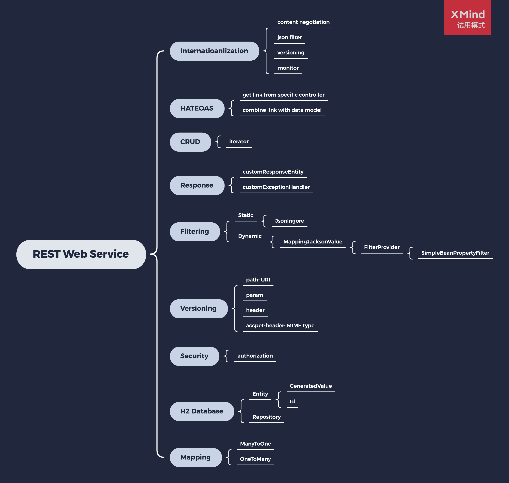
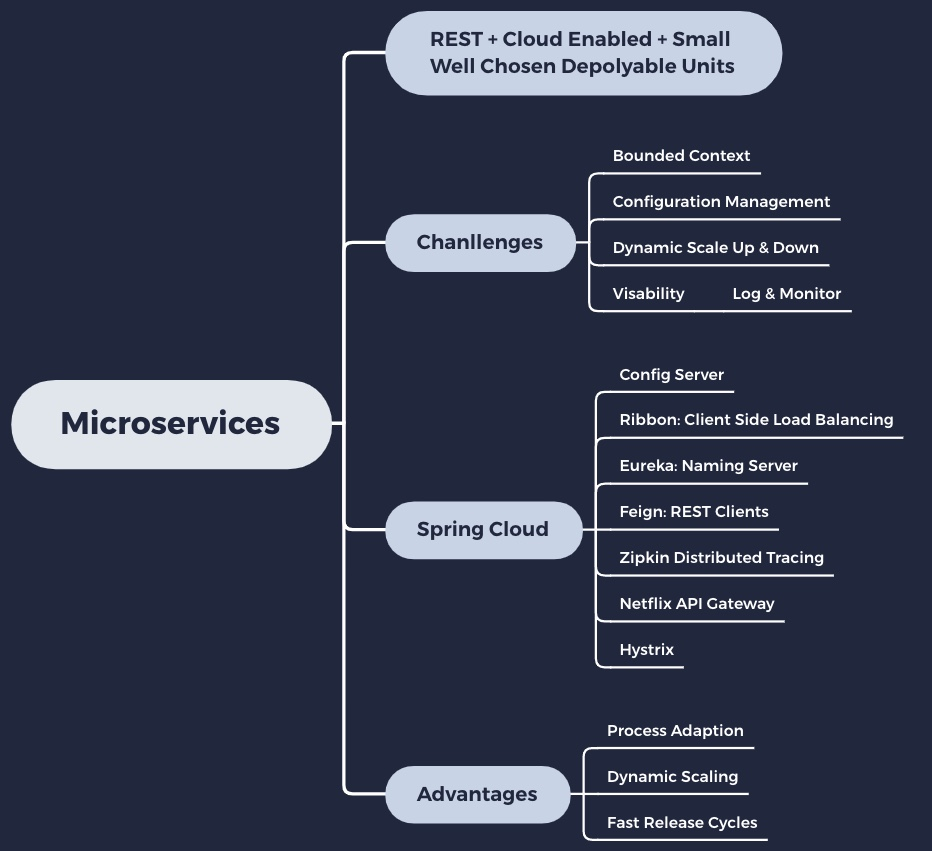

| Application                                           | Port                  |
| ----------------------------------------------------- | --------------------- |
| Limits Microservice (multiple instances)              | 8080, 8081, ...       |
| Spring Cloud Config Server                            | 8888                  |
| Currency Exchange Microservice (multiple instances)   | 8000, 8001, 8002, ..  |
| Currency Conversion Microservice (multiple instances) | 8100, 8101, 8102, ... |
| Netflix Eureka Naming Server                          | 8761                  |
| API Gateway                                           | 8765                  |
| Zipkin Distributed Tracing Server                     | 9411                  |

Feign Client: Proxy Design 

Feign allows you to write your own code on top of http libraries 

